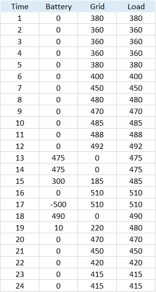

## Introduction

The continuing increase in the demand and aging of the power system infrastructure has led to serious concerns about consumer safety, resiliency, reliability, and power quality. The development and modernization of the power system infrastructure require massive investment by governments. Moreover, with respect to environmental concerns, the global policy focus is on proliferating low-carbon energy sources. Considering these issues, Distributed Energy Resources (DERs) are one of the best solutions to tackle the aforementioned problems. DERs include a variety of distributed generation (DG) units such as wind turbines (WTs), photovoltaics (PVs), gas generators, and energy storage systems (ESSs) such as electrical batteries. In this regard, a Distributed Energy Resource Management System (DERMS) is required to dispatch the daily optimal operation schedule of DERs to meet certain operational objectives (e.g. minimizing costs). In the first step of this project, we propose a battery management system (BMS) to determine the optimal daily dispatch of batteries (i.e. the amount of charging and discharging power of batteries) according to the different operational categories of batteries (i.e. UPS or PCS mode).

In order to gain an insight into the related algorithm of BMS, the following flowchart is presented.

It should be noted that in this project we have a rescheduling process during the scheduling horizon. In other words, when the predicted load is changed, or starting/ending time of each program (i.e. GA, DR, HOEP) is changed, a rescheduling process based on the following flowchart is needed:

## Different scenarios

• Global Adjustment (GA)   
• Demand Response (DR)  
• Hourly Ontario Energy Price (HOEP)

Based on the received signals (i.e., DR, GA, and HOEP), DERMS should make a decision on the amount of charging or discharging power of batteries. Considering the number of activated programs (one, two, or three programs are activated in the typical day) and their timing correlations, different scenarios are generated. To this end, 40 different algorithms are designed for each mode of operation (UPS/PCS). All these algorithms are categorized in the following 7 timelines.

• Just one of the GA, or DR or HOEP is activated in the scheduled day.

• A pair of two programs (GA,DR), or (GA,HOEP), or (DR, HOEP) is activated in the scheduled day.

• All the three programs are activated in the scheduled day.

## Case Study
As a case study, we consider a battery with a maximum capacity of 1250 kWh and a maximum power of 500 kW. This battery alongside the grid should meet the facility load as shown in the following figure:

As an example we consider the following load profile and activation times for the three mentioned programs: 

Power scheduling for battery, grid and load are as follows: 

## Rescheduling process

When inputs of DERMS, i.e. amount of load, GA, DR, or HOEP status or activation times, are changed during the day, an alarm with proper content should be sent to the panel for the operator. At this time, the experienced operator should decide whether to accept the action or reject it. If the applied action is accepted, then the DERMS model is executed and the rescheduling process is started. 

